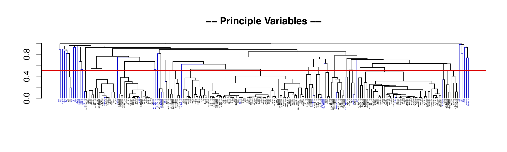
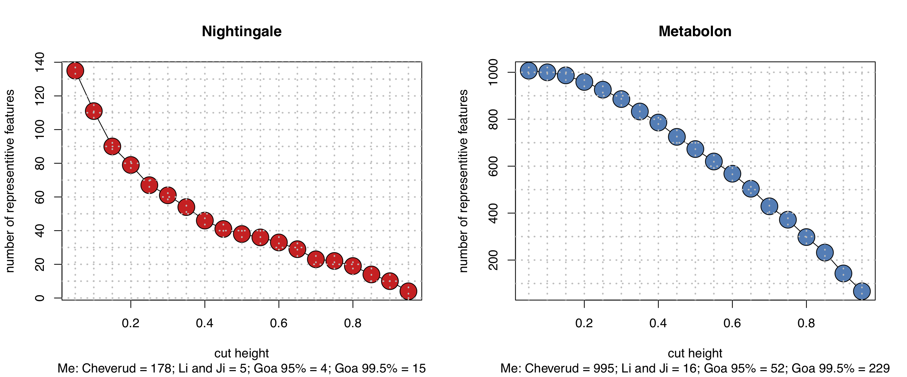
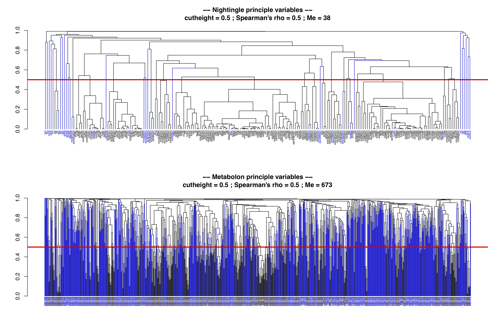
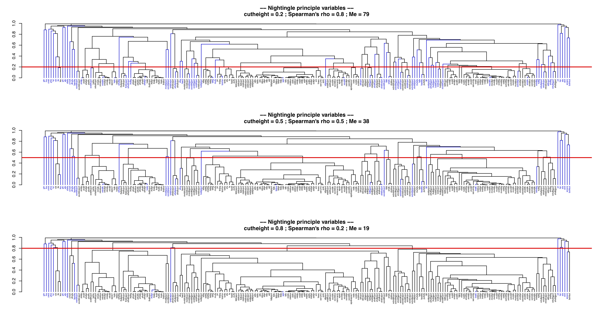

# iPVs
## identification of principal variables

### Authors: David Hughes 
##### Date started: 6th March 2020

### About:

This repo contains an R package called iPVs. The purpose of iPVs is to aid users with with the identification of representative (or independent) principal variables in an inter-correlated data set. The count of representative principal variables may also be used as a count of the number of independent variables (Me) in your data set. 

### Installation instructions of the iPVs package

	1. insure that the devtools library is installed on your local machine
		 > ifelse("devtools" %in% rownames(installed.packages()), 
		 NA, install.packages("devtools") )
		 
	2. install iPVs
		> devtools::install_github("hughesevoanth/iPVs")

___
		
## Describing the independent principal variable pipeline (iPVs)

This suite of scripts can help you identify a set of independent features or variables in a dataset with correlated features, such as that found in microbiomics or metabolomics. It is based on Spearman's rank correlations and a tree cutting step to identify clusters of features that are then used to identify a tagging variable using principal variable analysis (PVA). 

Once you have installed the moosefun package as described above, open an R session and follow the example below for a relatively straight forward run through of the iPVs pipeline using a single wrapper function. 

#### iPVs()
	
	## load your dataset (mine is a flat text file tab-delimited)
	n = "pathtomydataset/mydataset.txt"
	mydata = read.table(n, header = TRUE, sep = "\t", as.is = TRUE)
	
	## perform any QC that you would like
	## I will filter on feature missingness
	fmis = apply(mydata, 2, function(x){  sum(is.na(x))/length(x) })
	w = which(fmis > 0.2)
	wdata = mydata[, -w]
	
	## NO data transformation is required
	## as we will be using the non-parametric 
	## Spearman's rank correlation. 
	
	#######################################
	## A quick and easy wrapper function to
	## do everything for you is:
	#######################################
	## a series of cut heights
	s = seq(0.1, 0.5, by = 0.1)
	mypvs = iPVs(wdata, 
		cor_method = "spearman", 				## you can choose spearman or pearson
		dist_method = "R", 					    ## you can choose 'R' (1-abs(R)) or 'R2' (R*R)
		hclust_meth = "complete", 				## you can choose 'complete', 'average' (UPGMA), or 'mcquitty' (WPGMA)
		cutheight  = c(0.2, 0.3, 0.4, 0.5),     ## 1 or a series of cut heights
		cmat = NULL) 			                ## you can provide your own correlation matrix, which can save time.
		)
	
	## Done !
	
#### results: "mypvs" will contain a list of 4 objects:
	
	1. mypvs$iPV_table -- a data.frame containing:
		- PVs: the PVs identifier
		- clustersize: the number of variables in the cluster
		- VarExp_by_PV: the variance explained by the PV for its cluster of features|variables
		- ind_VarExp_rank: the rank of your PV in its informativness, individually, relative to all other variables in the cluster. This is a ranking of VarExp_by_PV as presented in mypvs$PVresults
		- PVArank: the rank of your PV in the PVA results as presented in mypvs$PVresults
	2. mypvs$PV_cluster_members -- a list providing all feature|variable ids in each cluster, supplied as a vector.
	3. mypvs$PVresults -- a list providing all of the PVA results for each cluster, as a data.frame  in PV_cluster_members
	4. mypvs$workingdata -- a list returning your:
		- mypvs$workingdata$variabledata == provided dataset
		- mypvs$workingdata$cormat == its correlation matrix
		- mypvs$workingdata$distmat == its distance matrix
		- mypvs$workingdata$tree == the initial tree of the complete dataset
		- mypvs$workingdata$eigenvalues == eigenvalues derived from the correlation matrix
		- mypvs$workingdata$pca == pca derived from the correlation matrix
		- mypvs$workingdata$varexp == varexp in PCA
		- mypvs$workingdata$simpleM == and estimates of Me, the effective number of markers. 

## Other estimates of the effective number of markers

iPVs also estimates Me (the effective number of markers) following three other methods. Each of these methods derive their estimates from an eigen or principal component analysis of the data's correlation matrix. 

1. J M Cheverud, Heredity, 2001. PMID:[11678987](11678987); [DOI]( https://doi.org/10.1046/j.1365-2540.2001.00901.x)
	- Meff: 1 + (M - 1) * (1 - ( variance(eigenvalues)/M ))
2. Li and Ji, Herdity, 2005. PMID:[16077740](16077740); [DOI](https://doi.org/10.1038/sj.hdy.6800717)
	- Meff: estimated as the number of eigenvalues whose proportion of variance explained is greater than or equal to 1, plus the sum of all other eigenvlaues. 
3. Goa et al, Genetic Epidemiology 2008. PMID:[18271029](18271029); [DOI](https://doi.org/10.1002/gepi.20310)
	- simpleM: estimated as the number of eigenvalues that are needed to explain X% of the variance. Here iPVs provides estimates for 95% and 99.5% of the variance. 

**These estimates can be extracted from your run of iPVs with:**
	
	> mypvs$workingdata$simpleM 

## Plotting

#### plot your tree with some color coding for the iPVs
	
	## load a needed R package
	library(dendextend)

	## extract the IDs for your PVs
	pv_ids = as.character(mypvs$iPV_table$PVs )

	## define your tree as a dendrogram
	dend = mypvs$workingdata$tree %>% as.dendrogram

	## create a vector of colors to color your tree labels
	n = labels(dend)
	pcol = rep("black", length(n))
	w = which(n %in% pv_ids ); pcol[w] = "medium blue"

	## redefine elements of dendrogram
	dend = dend %>% 
	set("labels_cex", 0.5) %>% 
  	set("labels_col", pcol) %>% 
  	set("branches_k_color",  value = pcol)

	## plot the dendrogram
	dend %>% plot(main = paste0( "-- Principle Variables --" ) )
	abline(h = 0.5, col = "red", lwd = 3)
	
If you run iPVs() with multiple cutheights then you can use an lapply() function to generate your dendrograms as follows:

	mydends = lapply(mypvs, function(x){
		## extract the IDs for your PVs
		pv_ids = as.character(x$iPV_table$PVs )

		## define your tree as a dendrogram
		dend = x$workingdata$tree %>% as.dendrogram

		## create a vector of colors to color your tree labels
		n = labels(dend)
		pcol = rep("black", length(n))
		w = which(n %in% pv_ids ); pcol[w] = "medium blue"

		## redefine elements of dendrogram
		dend = dend %>% 
		set("labels_cex", 0.5) %>% 
		set("labels_col", pcol) %>% 
		set("branches_k_color",  value = pcol)

		## return dendrogram
		return(dend)
	})
	
## plot the dendrograms

	## plot 1st dendrogram
	mydends[[1]] %>% plot(main = paste0( "-- Principle Variables --" ) )
	abline(h = 0.2, col = "red", lwd = 3)
	
	## plot 2nd dendrogram
	mydends[[2]] %>% plot(main = paste0( "-- Principle Variables --" ) )
	abline(h = 0.3, col = "red", lwd = 3)

#### alternative - long hand

If you would perfer to do everything step by step then feel free to print the function iPVs() to screen in an R session like 
	
	> iPVs 

and use its code to run through the steps of the pipeline. 

---
---
# Illustrations from metabolomics data sets:

### how the number of representitive features (Me) changes as the tree cut height increases

#### - examples from a Nightingale and a Metabolon data set -

The estimated number of effective markers, as determined by the methods of (1) Cheverud, (2) Li & Ji, and (3) Goa et al are printed at the bottom of each figure. 

---

#### Outcome for a tree cut height of 0.5 for a Nightingale and a Metabolon data sets.

---

#### Illustrative contrast of a Nightingale data set at three different tree cut heights:
- 0.2, 0.5, and 0.8

---
---
### Some  other functions in the iPVs suite include

#### treecut.pvs( tree, variabledata, cutheight )
- which will extract principal variables for a single step tree cut, given a specified cut height. 
- you must provide an hclust object, your raw variable data set (variables in cols) and the height at which to cut your tree. It is recommended to generate your tree with hclust( mydistmat, method = "complete"), when your distance matrix is 1 - abs(correlation coefficient).

#### treecut.sumstats(tree, cormat, cutheight)
- will calculate a few summary statistics for any desired tree cut height. 
- specifically, for any identified cluster with an N > 1 it will provide:
	- the number of features in the cluster
	- the minimum rho observed among members of the cluster
	- the mean rho observed among members of the cluster
	- the max rho observed among members of the cluster
	- the standard deviation in rho among members of the cluster, assuming N > 2

#### treecut.iterator.4minrho( tree, cormat, cutheights)
- will calculate the minimum rho observed (1) among members of identified clusters and then (2) among all of those minimums, given a vector (series) of cut heights. In effect it is identifying the longest branch in any cluster at a given cut height and returning the dissimularity value. 

